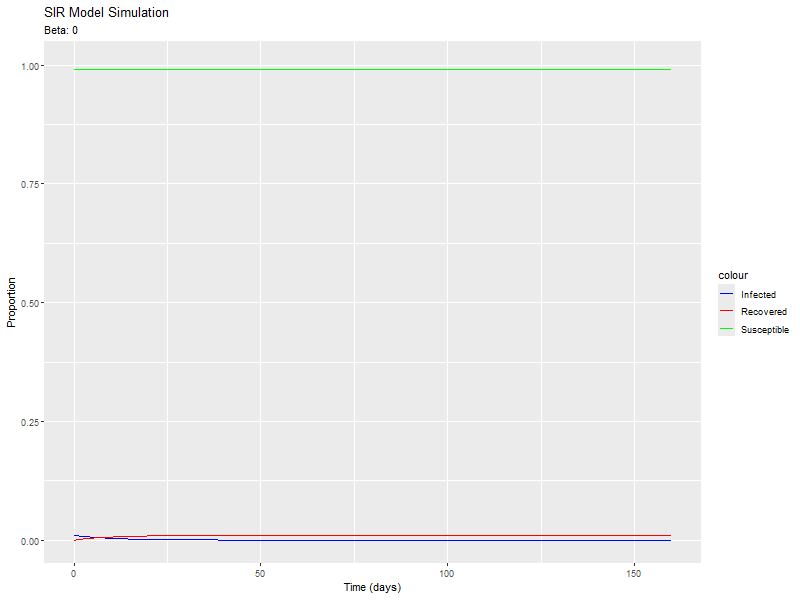

```{r setup, include=FALSE}
knitr::opts_chunk$set(echo = TRUE)
```

## SIR Modeling:

- *sir_model function:* Defines the differential equations for the SIR model.
- *Initial conditions and parameters:* Sets the initial state of the population and the model parameters (transmission and recovery rates).
- *Time frame:* Defines the period over which the simulation runs.
- *Solving the SIR model:* Uses the ode function from the deSolve package to solve the differential equations.
- *Plotting:* Visualizes the proportions of the susceptible, infected, and recovered populations over time.
- *Basic Reproduction Number (R0):* Calculates the basic reproduction number to understand the spread potential of the disease.

```{r cars}
#------------SIR Modeling----------#

# First, download deSolve from https://desolve.r-forge.r-project.org/
# which is a differential equations package
#install.packages("deSolve") 
#install.packages("ggplot2")
#install.packages("gganimate")

library("deSolve")

# Define the SIR model function
sir_model <- function(time, state, parameters) {
  with(as.list(c(state, parameters)), {
    dS <- -beta * S * I # Rate of change of the Susceptible class
    dI <- beta * S * I - gamma * I # Rate of change of the Infected class
    dR <- gamma * I # Rate of change of the Recovered class
    
    # Return the rate of change for each class
    list(c(dS, dI, dR))
  })
}

# Initial conditions
initial_state <- c(S = 0.99, # 99% susceptible
                   I = 0.01, # 1% infected
                   R = 0.00) # 0% recovered

# Parameters
parameters <- c(beta = 0.3,  # Transmission rate
                gamma = 0.1) # Recovery rate

# Time frame
times <- seq(0, 160, by = 1) # Simulate for 160 days

# Solve the SIR problem
out <- ode(y = initial_state, times = times, func = sir_model, parms = parameters)

# After 130 days, for example...
out[130,]
# This shows the proportion of the population in each class

# Convert the output to a data frame for plotting
out_df <- as.data.frame(out)
plot(out_df$time, out_df$S, type = "l", col = "blue", ylim = c(0, 1), xlab = "Time", ylab = "Proportion", lwd = 2,
     main = "SIR Model")
lines(out_df$time, out_df$I, col = "red", lwd = 2)
lines(out_df$time, out_df$R, col = "green", lwd = 2)
legend("right", legend = c("Susceptible", "Infected", "Recovered"), col = c("blue", "red", "green"), lwd = 2)

# Basic Reproduction number
R_0 <- parameters[1] / parameters[2] # R0 = beta / gamma
R_0
# This shows how many individuals (or plants) an individual will spread the disease to
```

## Epidemic Networks:

*Random Network:* Creates and plots a random network using the Erdős–Rényi model.
*Small World Network:* Creates and plots a small-world network and calculates its average local transitivity (a measure of the clustering coefficient).
*Scale-Free Network:* Creates and plots a scale-free network using the Barabási–Albert model and calculates its average degree.
*Degree Distribution:* Plots the degree distribution histograms for the small-world and scale-free networks to analyze their structure.

```{r pressure, echo=FALSE}

#------Epidemic Networks-------#

library(igraph)

# Random Network
num_nodes <- 20
prob_of_connections <- 0.1
random_network <- erdos.renyi.game(n = num_nodes, p = prob_of_connections,
                                   type = "gnp", directed = FALSE)
plot(random_network,
     vertex.size = 20, vertex.color = "yellow",
     vertex.label.cex = 0.8, edge.curved = FALSE)

# Small World Network
small_world <- graph(c(1,2,2,3,3,1,1,4,4,5,5,1,1,6,1,7), directed = FALSE)
plot(small_world)

# Calculate the average local transitivity (clustering coefficient)
(1/7) * sum(transitivity(small_world, type = "local"), na.rm = TRUE)

# Scale-Free Network
scale_free_network <- barabasi.game(n = 20, m = 2, directed = FALSE)

# Plot the scale-free network
plot(scale_free_network,
     vertex.size = 20,
     vertex.color = "yellow", vertex.label.cex = 0.8,
     edge.arrow.size = 0.5,
     edge.curved = FALSE)

# Optional: Calculate and print the average degree of the network
avg_degree <- mean(degree(scale_free_network))
avg_degree

# Look at the degree distribution of the networks
hist(degree(small_world))
hist(degree(scale_free_network))
```


## Simulation of Epidemic Spread:

```{r simulation}
# Load required packages
library(deSolve)
library(ggplot2)
library(gganimate)
library(Cairo)
# Initial conditions
#Play with them!!
initial_state <- c(S = 0.99, # 99% susceptible
                   I = 0.01, # 1% infected
                   R = 0.00) # 0% recovered

# Parameters
gamma <- 0.1 # Recovery rate

# Time frame
times <- seq(0, 160, by = 1) # Simulate for 160 days

# Generate 100 values for beta from 0 to 1
beta_values <- seq(0, 1, length.out = 100)

# Create a data frame to store simulation results
simulation_results <- data.frame()

# Loop over each beta value and solve the SIR model
for (beta in beta_values) {
  parameters <- c(beta = beta, gamma = gamma)
  
  # Solve the SIR model
  out <- ode(y = initial_state, times = times, func = sir_model, parms = parameters)
  
  # Convert to a data frame
  out_df <- as.data.frame(out)
  
  # Add beta to the data frame
  out_df$beta <- beta
  
  # Combine with the results
  simulation_results <- rbind(simulation_results, out_df)
}

# Plotting the results using ggplot2
p <- ggplot(simulation_results, aes(x = time)) +
  geom_line(aes(y = S, color = "Susceptible")) +
  geom_line(aes(y = I, color = "Infected")) +
  geom_line(aes(y = R, color = "Recovered")) +
  labs(title = 'SIR Model Simulation', x = 'Time (days)', y = 'Proportion') +
  scale_color_manual(values = c("blue", "red", "green")) +
  transition_states(beta, transition_length = 1, state_length = 1) +
  labs(subtitle = 'Beta: {closest_state}')

# Create the animation
#animation <- animate(p, nframes = length(beta_values), fps = 10, width = 800, height = 600, renderer = gifski_renderer())

# Save the animation
#anim_save("sir_model_simulation.gif", animation)

#animation


```

## SI Modeling

```{SI Modeling in R}
library(igraph)
SI_adj_matrix<-matrix(c(0,1,1,0,0,0,0,
                        0,0,1,1,0,0,0,
                        0,1,0,1,0,0,0,
                        0,1,1,0,0,0,0,
                        0,0,0,1,0,1,0,
                        0,0,1,0,0,0,1,
                        0,0,0,0,0,1,0), nrow=7,ncol=7)
SI_adj_matrix<-graph_from_adjacency_matrix(SI_adj_matrix)
plot(SI_adj_matrix, directed=TRUE)

prob_disease_movement<-0.5

disease_start_node<-sample(0:7,1) #which node has disease

#if the disease starts at Node 1 or Node 5, disease will not move in this
#directed networks

infected <- rep(FALSE, vcount(SI_adj_matrix))
infected[disease_start_node] <- TRUE
infected
epidemic_time_steps<-10 #how many time steps is this simulation

simulate_step <- function(g, infected, prob_disease_movement) { #this function simulates disese 
  #expansion across the adjacency matrix 
  new_infected <- infected
  for (node in 1:vcount(SI_adj_matrix)) {
    if (infected[node]) {
      neighbors <- neighbors(SI_adj_matrix, node, mode = "out")
      for (neighbor in neighbors) {
        if (!infected[neighbor] && runif(1) < prob_disease_movement) {
          new_infected[neighbor] <- TRUE
        }
      }
    }
  }
  return(new_infected)
}

for (i in 1:epidemic_time_steps) {
  infected <- simulate_step(g, infected, prob_disease_movement)
  print(infected)  # Print infection status at each time step
}

V(SI_adj_matrix)$color <- ifelse(infected, "red", "green")
plot(SI_adj_matrix, vertex.label=1:vcount(SI_adj_matrix), main="Disease Spread Simulation")

#try again with new starting nodes or different probabilities, starting nodes,
#and different time steps to simulate epidemics across various scenarios
```

```{r}

```
